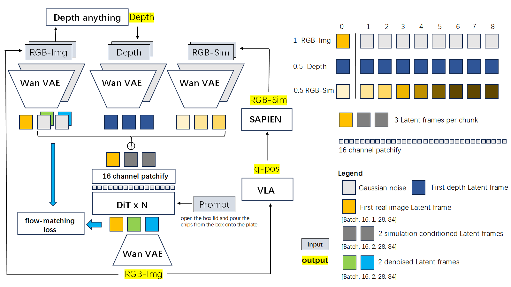
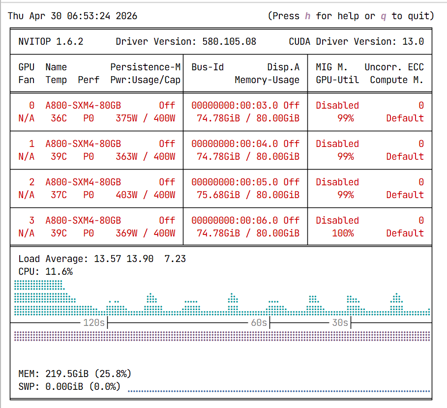
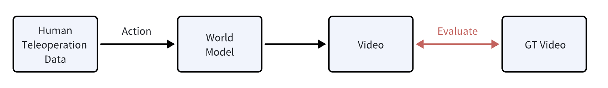
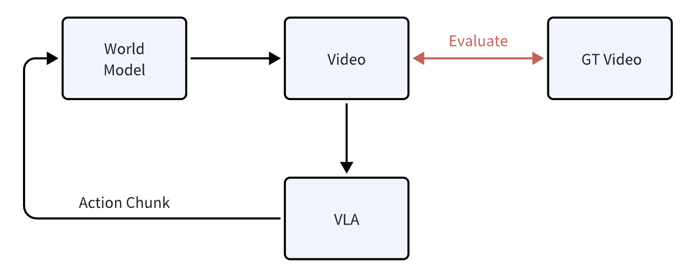

<div align="center" style="font-family: charter;">
    <h1> Giga Dreamer | CVPR-2026-Workshop-WM-Track </h1>


​    

⭐inherited from ：[CVPR-2026-Workshop-WM-Track](https://github.com/open-gigaai/CVPR-2026-Workshop-WM-Track)  

🌟**TLDR** : Modified the pipeline to support single-RTX 5090 online inference by decoupling VLA execution on CPU , WM and simulator on consuming GPU. Added colored depth-map conditioning and a latent normalization layer(AdaIN) for improved stability and control consistency. The model architecture and inference results are shown below.


- 1）修改VLA的张量detype可部署在CPU
  - 实现：WM-GPU（27G VRAM）,VLA-CPU(),simulator-4090laptop（<1G VRAM） ，
  - 硬件规格：5090 32GB VRAM+285K 64GB RAM +4090laptop 16GB VRAM
  
-  2）重构了控制输入方式，增加了基于纯深度图的推理，提供了批量推理/checkpoint与output同步脚本

- 3）在VAE latent 注入控制信号时，对于tensor体素逐channel做了分布对齐(AdaIN)，以维持均latent差特征与RGB-chunk编码一致

```python
    #transofrmer_wan_condition.py
    #ori-code：
    #		hidden_states = hidden_states + depth_states * 0.5 + replay_states * 0.5
    #		input tensor shape  (B, 16, F_latent, H_latent, W_latent)
   			mixed = hidden_states + depth_states * 0.5 + replay_states * 0.5 #origin design
            
            #  hidden_states channel wise mariginal distrubution B=0, C=1, F=2, H=3, W=4
            orig_mean = hidden_states.mean(dim=(0, 2, 3, 4), keepdim=True)
            orig_std = hidden_states.std(dim=(0, 2, 3, 4), keepdim=True)
            
            # get mixed channel wise mariginal distrubution
            mixed_mean = mixed.mean(dim=(0, 2, 3, 4), keepdim=True)
            mixed_std = mixed.std(dim=(0, 2, 3, 4), keepdim=True)
            
            # resize to the vae-encoded high dimensional spherical shell
            hidden_states = (mixed - mixed_mean) / (mixed_std + 1e-5) * orig_std + orig_mean
```


### 模型架构

基于wan2.2-5B DiT only, 包含深度图组件/VLA组件/SAPIEN仿真器  VAE在训练时候冻结：



### 推理

单次有效生成8frame(2 latent frame)

单次输入9 帧 (1 ref + 8 未来帧条件)  生成Latent: (1, 16, 3, 28, 84) 为 3 个 temporal latent chunks（1 reference latent+ 2 embedded noise）

30步去噪，每一步去噪起始都重置reference latent

VAE decode后 得到 1ref+ 8 生成帧数

用 第7生成帧作为ref 帧，保留8帧作为输出视频（1ref+7生成帧）

loop 

注：首帧过VAE跳过了时间压缩直接得到 reference latent

### 训练

环境为4卡A800 单任务训练速度4h/10epochs



# Inference results of single-task trained model

wan2.2视频帧数在16fps，不同数采频率/VLA 输出并未完全与视频模型对齐，因此全部按照帧数进行计算总长度，且不使用插帧。

## task6 fold white T-shirts

#### 90 epochs


inference using trajectories in training set,total frame 849


inference using VLA roll out trajectories ,total frame 1041

#### 40 epochs


inference using real world rollout trajectories not seen in training sets ,total frame 1185

Note: the results are not fully stable and may exhibit artifacts, reduced sharpness, temporal flickering, or interaction failures. training loss converged after 80epochs 

## task h1 fold black shirt via depth-control


limited datasets，test only，long rollouts  1185 frames

## task4 Open the box and transfer the fries onto the plate


Challenge: transparent materials,median length ，545 frame

## task 3 fold the box


complex manipulation ,401frame

## task2 Placing the bowl onto the plate


short motion ,209 frame 

visual occlusion causing object disappearance.

## 关于长视频问题

wan2.2-5B 参数较小且训练数据少有30s+，且基于embedding的控制不同于训练时通过cross attention注入*[ref](https://mp.weixin.qq.com/s/s6VNn45vUNUsu8_r3NBsQg)

rollout设置为33帧，对标于VLA一次产生的动作一般不会超过50steps （从质量上看也失去了持续生成长视频的能力）

需要调大batch size 得到一定程度的基模后，再持续的往后训练。

# 推理（offlineand online）



视频角度：画面质量/空间，物理一致性/指令跟随 etc. | 有多好？👆（offline）

交互角度：对于vla的影响 | WM相比于真实世界对于策略选择的影响/谁更接近于最优的策略选择？👇（online）



评估指标共三类: ==world arena / Pbench-nvidia / Veo-sim==


[](https://opensource.org/licenses/Apache-2.0)
[](https://gigaai-research.github.io/GigaBrain-Challenge-2026/index.html#about)
[](https://huggingface.co/collections/open-gigaai/cvpr-2026-worldmodel-track)
[](https://huggingface.co/datasets/open-gigaai/CVPR-2026-WorldModel-Track-Dataset/tree/main)
[](https://huggingface.co/spaces/open-gigaai/CVPR-2026-WorldModel-Track-LeaderBoard)


## About

The repo contains the code and dataset for the World Models Track of GigaBrain Challenge 2026 CVPR Workshop. We provide the information of the dataset and the world models baseline code for training and inference on the track dataset.


### Dataset

Download dataset from [huggingface](https://huggingface.co/datasets/open-gigaai/CVPR-2026-WorldModel-Track-Dataset). The data consists of multiple tasks.

Each sub-task dataset offering three functional splits as detailed below: the Train split provides full ground-truth (GT) videos and trajectories for supervised learning; the Video Quality split provides only first frames and full trajectories to benchmark conditional video generation; and the Evaluator split provides only initial frames and states to support closed-loop VLA (Vision-Language-Action) interaction and evaluation.

| Split | Ground Truth Videos | Trajectory Data | Initial State/Pose | Primary Usage                       |
| :--- |:-------------------:| :---: | :---: |:------------------------------------|
| **Train** |         ✅           | ✅  | ✅ | Model Training                      |
| **Video Quality** |          ❌          | ✅  | ✅ | Video Quality Benchmark             |
| **Evaluator** |          ❌          | ❌ | ✅ (Initial Only) | WM (as evaluator) & VLA interaction |

each task subdirectory has the following file structure,

```bash
task/
├── train/                    # Main training data
│   ├── metas/                # JSON files containing task instructions
│   │   ├── episode_0.json
│   │   └── ...
│   ├── trajectories/         # state sequences (.pkl)
│   │   ├── episode_0.pkl
│   │   └── ...
│   └── videos/               # Multiview video recordings (.mp4)
│       ├── cam_high/       
│       │   ├── episode_0.mp4
│       │   └── ...
│       ├── cam_left_wrist/  
│       └── cam_right_wrist/ 
├── evaluator/                # As evaluator test set
│   ├── episode_0/            # Test episode initial states
│   │   ├── cam_high.png      # Reference image (High view)
│   │   ├── cam_left_wrist.png
│   │   ├── cam_right_wrist.png
│   │   ├── meta.json        
│   │   └── initial_state.pkl 
│   └── ...                  
└── video_quality/            # Video quality evaluation set
    ├── episode_0/            
    │   ├── cam_high.png
    │   ├── cam_left_wrist.png
    │   ├── cam_right_wrist.png
    │   ├── meta.json
    │   └── traj.pkl
    └── ...
```
> **Bonus for training episode:** alongside the ground-truth videos, we also supply depth maps and simulator renderings.
>
> （也可也自己launch ，通过点云还原深度


## Environment setup and Pretrained Model Download

* **Base environment**

We provide baseline world model code for training and inference. [GigaTrain](https://github.com/open-gigaai/giga-train) and [GigaDataset](https://github.com/open-gigaai/giga-datasets) is used for framework of training and dataset loading respectively.
The base environment for training is the same as the [GigaTrain](https://github.com/open-gigaai/giga-train) and [GigaDataset](https://github.com/open-gigaai/giga-datasets).


```bash
conda create -n giga_torch python=3.11.10
conda activate giga_torch

# install giga-train
cd third_party/giga-train
pip3 install -e .

# install giga-datasets 
cd third_party/giga-datasets
pip3 install -e .
```

* **Robotwin2.0 simulator environment**

As the baseline world model use Robotwin2.0 simulator to render qpos action to images, we need to install the simulator following the [instruction](https://robotwin-platform.github.io/doc/usage/robotwin-install.html).

* **Download pretrained model**

We put the all needed pretrained model information in code `cvpr_2026_workshop_wm_track/model_config.py`. You can change the `HUGGINGFACE_MODEL_CACHE` to your own cache directory. And download the pretrained models by running the following command.

```bash
# change HUGGINGFACE_MODEL_CACHE to your own cache directory
HUGGINGFACE_MODEL_CACHE = "/shared_disk/models/huggingface" # line 3 of cvpr_2026_workshop_wm_track/model_config.py

# download pretrained models
python scripts/download_pretrained_models.py

# download gigabrain policy for online evaluation
python scripts/download_gigabrain_policy.py

```

## Train

We provide a simple training script that integrates with GigaTrain.  
Below are the steps to launch training after you have packed the data and downloaded pretrained models.


1. Pack training data in giga-datasets format 

Pack training data for each task. If you want to pack all tasks, you can set `--task all`. 

```bash
# USE DEFAULT DATA_DIR if not specified, You can also use the default DATA_DIR in model_config.py
python scripts/pack_training_data.py --task all 
# pack task4 data
python scripts/pack_training_data.py --data_dir /path/to/dataset --task task4 
# pack task1-8 data
python scripts/pack_training_data.py --data_dir /path/to/dataset --task all 
```

2. Modify training config 

Modify `cvpr_2026_workshop_wm_track/configs/baseline_wm_task4.py` to specify training setting:  

- <span style="color:#1f77b4">_project_dir_</span>: <span style="color:#ff7f0e">set logging and checkpoint save directory</span>
- <span style="color:#1f77b4">_launch.gpu_ids_</span>: <span style="color:#ff7f0e">set available devices</span>
- <span style="color:#1f77b4">_train.checkpoint_interval_</span>: <span style="color:#ff7f0e">save checkpointing interval per epoch</span>


3. Launch training

```bash
# launch baseline world model training on task4 dataset
python scripts/launch_train.py --config_path cvpr_2026_workshop_wm_track.configs.baseline_wm_task4.config
# launch baseline world model training on all task dataset
python scripts/launch_train.py --config_path cvpr_2026_workshop_wm_track.configs.baseline_wm_alltask.config
```

## Inference

After training, you can use the world model to simulate robot behavior. We provide two inference modes:

**Offline**: No interaction with any policy; the world model directly consumes the trajectory data (e.g., `traj.pkl`) to generate future video frames. This mode is used for the **Video Quality** benchmark—purely evaluating the model’s ability to predict visual dynamics given ground-truth actions.

```bash
python scripts/inference.py --transformer_model_path /path/to/transformer --device_list 0,1,2,3 --output_dir outputs/baseline_wm --task task4 --mode offline
```

---

**Online**: The world model runs in a closed loop with a **policy** that outputs actions in real time. This mode is used for the **Evaluator** benchmark—testing how well the world model supports downstream VLA (Vision-Language-Action) agents by providing accurate next-state predictions under the policy’s actual action distribution.

Before online inference, you need to prepare simulator server which render qpos to images and policy server which get action from initial image and state.

1. Start simulator server

As the environment is not compatible with the baseline world model, we provide a separate simulator server for online inference.

```bash
# start simulator server, default port is 9051
python simulator/script/run_simulator_server.py --host_port 9151
```

2. Start world model & policy interaction inference

```bash
# as the simualtor server is not multi-thread, we only use one device for inference 
python scripts/inference.py --transformer_model_path /path/to/transformer --device_list 0 --output_dir outputs/baseline_wm --task task4 --mode online --policy_ckpt_dir /path/to/policy --policy_norm_stats /path/to/norm_stat_gigabrain.json --simulator_ip 127.0.0.1 --simulator_port 9151
```


### Submission

After online and offline inference, you can get below structure outputs:

```
outputs
├── video_quality_eval
│   ├── task1
│   │   ├── episode_0.mp4
│   │   └── ...
│   └── ...
└── evaluator_test
    ├── task1
    │   ├── episode_0.mp4
    │   └── ...
    └── ...
```

> Follow the instructions on the [World Model Track Leaderboard](https://huggingface.co/spaces/open-gigaai/CVPR-2026-WorldModel-Track-LeaderBoard) to package and submit the generated videos for all tasks in the required format.

---

<div align="center">

**Connect & Collaborate**  
Join community on [WeChat](https://www.wechat.com/en/) to share ideas, and team up with fellow participants.


</div>
